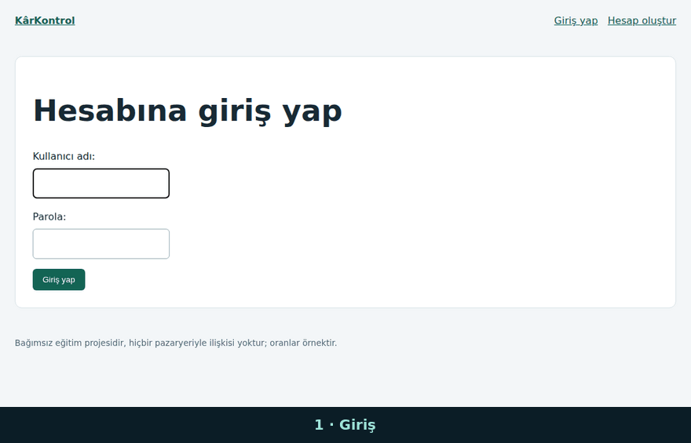
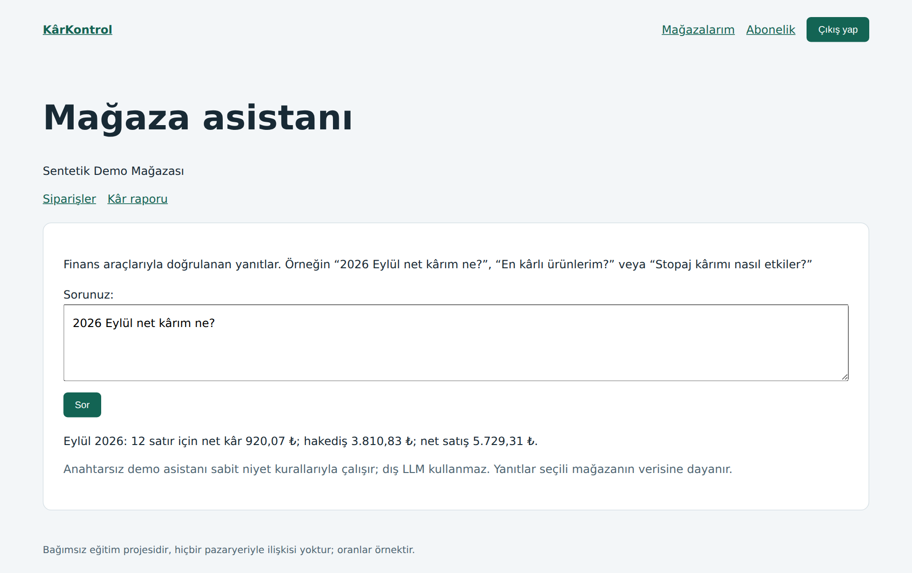
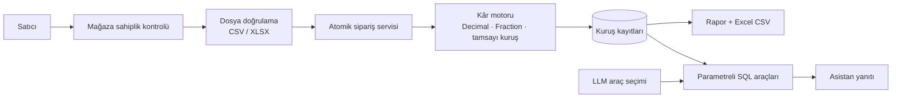

<p align="center">
  
</p>

<p align="center">
  <a href="https://nowackk-cp.github.io/karkontrol/lab/"></a>
  <a href="https://nowackk-cp.github.io/karkontrol/"></a>
  <a href="BUGS.md"></a>
</p>

<p align="center">
  <a href="https://github.com/nowackk-cp/karkontrol/actions/workflows/ci.yml"></a>
  <a href="https://github.com/nowackk-cp/karkontrol/actions/workflows/llm.yml"></a>
  
  
  
</p>

---

<details>
<summary><b>🇬🇧 English summary</b></summary>

**KârKontrol** is a Python/Django demo for marketplace sellers that calculates profit per order after commission, shipping tiers and costs, with a local LLM assistant that answers questions about the numbers. Most of the code was written by an AI coding agent; this project is about **proving that code is correct**.

- **669** automated tests (unit, integration, LLM eval) and **13** Playwright E2E tests on desktop and mobile
- **100%** branch coverage on the profit engine, **507/513** mutants killed (**98.83%** mutation score)
- LLM assistant evaluated on a 52-question set: **49/52 → 52/52**, tracked by GitHub Actions
- Every pull request must pass all gates before it can merge into `main`, admins included

Try the [Profit Lab](https://nowackk-cp.github.io/karkontrol/lab/), browse the [live test reports](https://nowackk-cp.github.io/karkontrol/) or read the [bugs the tests caught](BUGS.md). All data is synthetic.

</details>

---

## 🎬 30 saniyelik tur

<p align="center">
  
</p>

Giriş → mağaza kur → sipariş dosyası yükle → kâr raporu → asistana sor. Tüm veri sentetik.

---

## 🎯 Önce sen tahmin et

> Aynı termos. Aynı komisyon, aynı maliyet.
> **A:** 300,00 ₺'ye satılıyor. **B:** 300,01 ₺'ye satılıyor.
> Hangisi daha kârlı, ve fark ne kadar?

<details>
<summary><b>👉 Cevabı görmek için tıkla</b></summary>
<br>

**A, açık ara.** B'nin kârı **29,99 ₺ daha düşük**: 1 kuruşluk fiyat artışı siparişi bir üst kargo baremine taşır.

<p align="center">
  
</p>

Bu grafik elle çizilmedi: [`scripts/build_profit_lab.py`](scripts/build_profit_lab.py) onu gerçek kâr motorundan üretir
ve [bir test](tests/unit/test_profit_lab.py) her CI koşusunda grafiğin motorla birebir aynı kaldığını doğrular.

**Kendin dene →** [Kâr Laboratuvarı](https://nowackk-cp.github.io/karkontrol/lab/): fiyatı kaydır, komisyonu ve maliyeti değiştir,
"Kuruş Avcısı" oyununda sezgini test et.

</details>

Satıcı fiyatını bu rakamlara bakarak belirliyorsa, sınır değerdeki tek bir hata **yanlış karar** demektir.
Bu proje tam olarak o soruya cevap arıyor:

> ### Kodun büyük kısmını AI yazıyorsa, *doğru olduğunu nereden bileceğiz?*

---

## 🛡️ Bir siparişin yolculuğu

<p align="center">
  
</p>

Her pull request aynı kapılardan geçer ve biri kırmızıysa `main`'e birleşemez — yönetici dahil.
Bu iddia kanıtlandı: sahiplik kontrolünü **kasıtlı bozan** [PR #29](https://github.com/nowackk-cp/karkontrol/pull/29)
[kırmızıya düştü](https://github.com/nowackk-cp/karkontrol/actions/runs/37251575603),
GitHub [birleşmeyi engelledi](data/evidence/external-review/app001-demo/open-state.json) ve PR
[birleştirilmeden kapatıldı](data/evidence/external-review/app001-demo/closed-state.json).

<table>
<tr>
<td align="center" width="20%"><h2>669</h2><sub>otomatik test<br>unit · integration · eval</sub></td>
<td align="center" width="20%"><h2>13</h2><sub>Playwright E2E<br>masaüstü + mobil</sub></td>
<td align="center" width="20%"><h2>%100</h2><sub>kâr motoru<br>dal kapsamı</sub></td>
<td align="center" width="20%"><h2>507/513</h2><sub>mutant öldürüldü<br>%98,83</sub></td>
<td align="center" width="20%"><h2>52/52</h2><sub>LLM asistan eval<br>ilk koşu 49/52</sub></td>
</tr>
</table>

---

## 🐞 Hata avı: AI yazdı, testler yakaladı

Kod "çalışıyor" görünüyordu. Her kartı aç:

<details>
<summary>🔴 <b>APP-003 · Asistan zararı "veri yok" diye sakladı</b></summary>

| | |
|---|---|
| **Ne oldu?** | Satıcı "Eylül net kârım ne?" diye sordu; model Eylül yerine **Kasım**'ı sorguladı |
| **Satıcıya etkisi** | Gerçek sonuç **−60,00 ₺ zarar** iken cevap "veri yok" oldu |
| **Kim yakaladı?** | İlk gerçek LLM eval koşusu ([ham yanıt](data/evidence/llm-first.json)) |
| **Şimdi** | Tarih, kullanıcı sorusundan şemaya bağlanır; geçerli ama yanlış ay reddedilir. İki regresyon testi korur |

</details>

<details>
<summary>🔴 <b>IMP-001 · Excel'deki "%20" sessizce 0,20 okundu</b></summary>

| | |
|---|---|
| **Ne oldu?** | Yüzde biçimli Excel hücresi oran olarak kabul ediliyordu |
| **Satıcıya etkisi** | Yanlış komisyon/KDV oranıyla kayıt oluşabiliyordu |
| **Kim yakaladı?** | Dış inceleme, ardından regresyon testi |
| **Şimdi** | Yüzde biçimi açıklayıcı hatayla, **sıfır kayıtla** reddedilir |

</details>

<details>
<summary>🟠 <b>ENG-001 · Kuruşun "kime gideceği" yanlış seçildi</b></summary>

| | |
|---|---|
| **Ne oldu?** | 10 ₺ hizmet bedeli 100:10:10 oranında dağıtılırken eşit kalanlarda sıra yanlıştı |
| **Satıcıya etkisi** | 8,34 / 0,83 / 0,83 yerine 8,33 / 0,84 / 0,83 — kuruş yanlış satıra yazılıyordu |
| **Kim yakaladı?** | Dış inceleme, ardından regresyon testi |
| **Şimdi** | Tam rasyonel `Fraction`/`divmod` hesabı; kural sözleşmesinin §6 maddesi |

</details>

<details>
<summary>🟠 <b>ENG-002 · Çok hassas döviz kurunda 1 kuruş sapma</b></summary>

| | |
|---|---|
| **Ne oldu?** | 51 basamaklı USD kurunda ara hesap erken yuvarlanıyordu |
| **Satıcıya etkisi** | Brüt ve hakediş **0,01 ₺** sapıyordu |
| **Kim yakaladı?** | **Mutasyon testi** incelemesi ([13 mutantın analizi](data/evidence/external-review/mutation-first/current-survivors-review.md)) |
| **Şimdi** | Kur, oran, iade ve desi ara hesapları tamsayı kuruş ve `Fraction` ile |

</details>

<details>
<summary>🟡 <b>Ve dahası</b> · yabancı mağaza erişimi, 500 hatası, kısa CSV, geri alınamayan aktarım, Türkçe İ/I araması…</summary>

Her biri için ilk başarısız kanıt, düzeltme commit'i, regresyon testi ve GitHub issue'su: **[BUGS.md](BUGS.md)**.

</details>

**Kural:** testi geçirmek için beklenen sonuç asla gevşetilmez; kaynak kod düzeltilir. Başarısız ölçümler silinmez.

---

## 🤖 AI asistanın karnesi

Satıcı doğal dilde sorar. Model yalnızca **hangi aracın** çağrılacağını seçer;
rakamı parametreli SQL ve sunucu kodu üretir. Model tutar uyduramaz.

<p align="center">
  
</p>

```text
İlk gerçek koşu    ██████████████████░░  49/52   2 kritik hata: yanlış dönem, yanlış araç
Düzeltme sonrası   ████████████████████  52/52   kritik hata 0
Tekrar koşusu      ███████████████████░  51/52   kur sorusu → KDV kuralı (APP-007) — gizlenmedi, düzeltildi
Son ana dal        ████████████████████  52/52   kritik hata 0
```

Ham model yanıtları kaynak commit'e bağlı olarak [`data/evidence`](data/evidence/) altında saklanır · Tüm geçmiş: [OLCUMLER.md](docs/OLCUMLER.md)

---

## 🙅 Projede reddedilen kestirmeler

AI ile hızlı ilerlemenin bedeli, kolay yolu seçmek olmamalı:

| Cazip kestirme | Ne yapıldı |
|---|---|
| Motorun çıktısını "beklenen sonuç" olarak kaydetmek | ❌ Reddedildi; aynı hata iki tarafta saklanır. Beklenen değerler motordan türetilmez |
| Başarısız LLM koşusunu silip sadece başarılıyı göstermek | ❌ Reddedildi; ilk ham sonuç korundu |
| Testi geçirmek için beklentiyi gevşetmek | ❌ Reddedildi; kaynak kod düzeltildi |
| Aynı modelin hakemliğini insan kontrolü saymak | ❌ Reddedildi; ayrı model ve kör insan etiketi ayrıldı |

Tam kayıt: [AI ile çalışma](docs/AI_ILE_CALISMA.md)

---

## 🧭 Henüz kanıtlamadıkları

- **İnsan altın seti boş (0/40).** Mutabakat altyapısı hazır; elle doğrulanmış sipariş hesapları girilene kadar bu test bilerek kırmızıdır.
- **Asistan skorları geliştirme setinde alındı.** Görülmemiş insan sorularına genellemeyi kanıtlamaz.
- **Tarifeler sentetik.** Gerçek pazaryeri ücret tablolarıyla birebir uyum ve üretim dağıtımı yapılmadı.

---

<details>
<summary><b>🏗️ Mimari</b></summary>
<br>



- **Motor Django'yu bilmez:** saf Python; izole test ve mutasyon testi mümkün.
- **Para yalnız `Decimal`**, ara hesaplar tam rasyonel; yuvarlama tek noktada `ROUND_HALF_UP`.
- **Çoklu pazaryeri:** TRY demo tarifesi ve sabit kurlu Amazon USD/EUR demo hesabı.

| Katman | Araç | Neyi korur |
|---|---|---|
| Unit | pytest, Hypothesis | Komisyon, kargo baremi/desi, hizmet, stopaj, KDV, iade, kuruş dağıtımı, kur |
| Integration | pytest-django | CSV/XLSX aktarımı, atomik geri alma, mağaza sahipliği, CSRF, dosya sınırları, rapor/CSV/SQL tutarlılığı |
| E2E | Playwright, Page Object Model | Giriş, mağaza kurulumu, aktarım, iade, kâr ekranı, abonelik ödemesi — masaüstü ve mobil |
| Mutasyon | mutmut | Testlerin gerçekten hata yakaladığını ölçer; [kalan 6 mutantın incelemesi](data/evidence/external-review/mutation-final/final-six-survivors.md) |
| LLM eval | Gerçek Qwen, sabit prompt ve hash | Doğru araç, dönem ve kural seçimi |
| Mutabakat | `tests/reconciliation` | İnsan tarafından doğrulanmış altın siparişler; boş veri başarısızdır |

</details>

<details>
<summary><b>🚀 Üç komutla çalıştır</b></summary>
<br>

Python 3.13 ve [uv](https://docs.astral.sh/uv/) gerekir.

```bash
uv sync --locked --extra dev --extra e2e
uv run python manage.py bootstrap_demo
uv run python manage.py runserver 127.0.0.1:8001
```

[http://127.0.0.1:8001](http://127.0.0.1:8001/) → `demo-satici` / `demo-only-pass-2026` (yalnız DEBUG'da çalışan sentetik demo hesabı).

```bash
uv run ruff check . && uv run ruff format --check .
uv run python -m pytest -n 2 --cov                              # unit + integration + eval
uv run python -m playwright install chromium
uv run python -m pytest tests/e2e -m e2e --browser chromium      # tarayıcı testleri
uv run python -m pytest tests/reconciliation -m reconciliation   # insan mutabakatı
uv run python -m scripts.build_profit_lab                        # laboratuvar verisi + grafik
```

</details>

<details>
<summary><b>📚 Belgeler</b></summary>
<br>

| | |
|---|---|
| [KURALLAR.md](docs/KURALLAR.md) | Komisyon, kargo, iade, stopaj ve KDV hesap sözleşmesi |
| [QA_STRATEJISI.md](docs/QA_STRATEJISI.md) | Test stratejisi ve mutant incelemesi |
| [EVAL_RAPORU.md](docs/EVAL_RAPORU.md) | LLM değerlendirme protokolü |
| [ALTIN_SET.md](docs/ALTIN_SET.md) | İnsan doğrulamalı altın veri süreci |
| [OLCUMLER.md](docs/OLCUMLER.md) | Tüm ölçümler ve CI koşu bağlantıları |
| [AI_ILE_CALISMA.md](docs/AI_ILE_CALISMA.md) | AI ile çalışma kaydı |
| [BUGS.md](BUGS.md) · [CHANGELOG.md](CHANGELOG.md) | Hata kayıtları ve sürüm geçmişi |

</details>

<p align="center"><sub>Bağımsız portföy projesidir; hiçbir pazaryeriyle ilişkisi yoktur. Tüm veri ve tarifeler sentetiktir. · <a href="LICENSE">MIT</a></sub></p>
