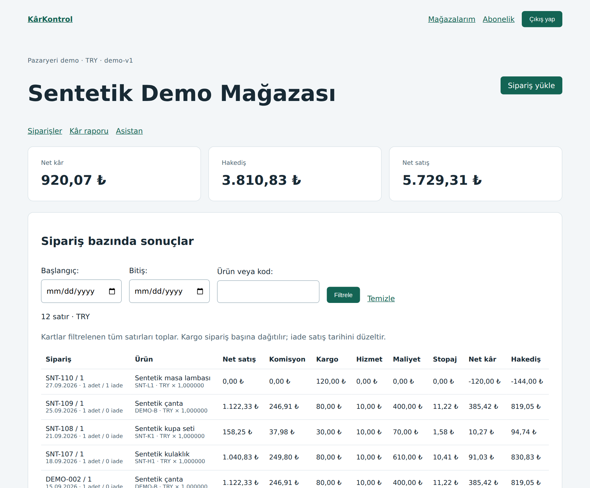
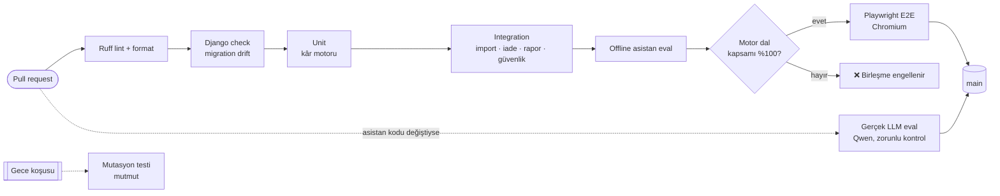
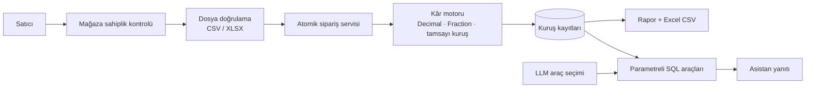

<div align="center">

# 🧮 KârKontrol

### Kodu AI yazdı. Doğru olduğunu testler kanıtlıyor.

Pazaryeri satıcıları için kâr ve hakediş uygulaması. Uygulama koduyla birlikte,<br>
**AI ajanının yazdığı finans kodunu kuruşu kuruşuna denetleyen bir kalite sistemi** de içerir.

[](https://github.com/nowackk-cp/karkontrol/actions/workflows/ci.yml)
[](https://github.com/nowackk-cp/karkontrol/actions/workflows/llm.yml)


[**Ne kanıtlıyor**](#-30-saniyede) · [**Yakalanan hatalar**](#-yakalanan-hatalar) · [**Kalite hattı**](#-kalite-hattı) · [**AI asistan eval**](#-ai-asistanın-karnesi) · [**Çalıştır**](#-üç-komutla-çalıştır) · [**HTML raporlar**](https://nowackk-cp.github.io/karkontrol/)

</div>

---

## ⚡ 30 saniyede

<table>
<tr>
<td align="center" width="25%"><h2>666</h2>otomatik test<br><sub>unit · integration · eval</sub></td>
<td align="center" width="25%"><h2>%100</h2>kâr motoru<br>dal kapsamı<br><sub>50/50 dal</sub></td>
<td align="center" width="25%"><h2>%98,83</h2>mutasyon skoru<br><sub>507/513 mutant öldürüldü</sub></td>
<td align="center" width="25%"><h2>15+</h2>gerçek hata<br>yakalandı ve düzeltildi<br><sub>regresyon testleriyle kapatıldı</sub></td>
</tr>
<tr>
<td align="center"><h2>13</h2>Playwright E2E<br><sub>masaüstü + 390×844 mobil</sub></td>
<td align="center"><h2>52/52</h2>LLM asistan eval<br><sub>ilk koşu 49/52 — hatalar korundu</sub></td>
<td align="center"><h2>0,01 ₺</h2>tolerans<br><sub>Decimal + ROUND_HALF_UP</sub></td>
<td align="center"><h2>🔒</h2>main korumalı<br><sub>kırmızı CI birleşemez</sub></td>
</tr>
</table>

> Kodun büyük kısmını bir AI ajanına (Codex) yazdırdım. Benim işim şu soruya cevap kurmaktı:
> **"Bu kodun doğru olduğunu nereden bileceğiz?"** — Cevap: kural sözleşmesi, bağımsız testler,
> mutasyon testi, tarayıcı testleri, LLM eval'i ve her PR'da zorunlu kalite kapısı.

<p align="center">
  
  <br><sub>Kâr raporu — sipariş bazında komisyon, kargo, hizmet bedeli, stopaj, net kâr ve hakediş. Tüm veri sentetiktir.</sub>
</p>

---

## 💡 Fiyatı 1 kuruş artır, 29,99 ₺ kaybet

Bu proje "fiyat artarsa kâr da artar" varsayımını testle kırar. Sentetik kargo bareminde
300,00 ₺ ile 300,01 ₺ arasında kargo bandı değişir:

| Sipariş | Fiyat | Kargo | Net kâr |
|---|---:|---:|---:|
| SNT-102 | 300,00 ₺ | 30,00 ₺ | **30,00 ₺** |
| SNT-103 | 300,01 ₺ | 60,00 ₺ | **0,01 ₺** 📉 |

Satıcı fiyatını bu rakamlara bakarak belirliyorsa, sınır değerdeki tek bir hata yanlış karar demektir.
Bu yüzden eşik, iade, kur ve kuruş dağıtımı davranışları ayrı ayrı testlenir.

---

## 🐞 Yakalanan hatalar

AI'ın yazdığı kod "çalışıyor" görünüyordu. Testler başka şey söyledi:

| | Hata | Nasıl yakalandı | Satıcıya etkisi |
|---|---|---|---|
| 🔴 | **APP-003** — asistan Eylül yerine Kasım'ı sorguladı | İlk gerçek LLM koşusu | −60,00 ₺ zarar, "veri yok" cevabının arkasında gizlendi |
| 🔴 | **IMP-001** — Excel'de `%20` biçimli oran 0,20 okundu | Dış inceleme + regresyon | Yanlış oranla kayıt oluşabiliyordu; artık atomik reddedilir |
| 🔴 | **IMP-002** — hatalı aktarım geri alınamıyordu | Dış inceleme + regresyon | Yanlış siparişler raporda kalıyordu |
| 🟠 | **ENG-001** — kuruş dağıtımında eşit kalan sırası | Dış inceleme + regresyon | 10 ₺ dağıtımında 8,33/0,84/0,83 yerine 8,34/0,83/0,83 olmalı |
| 🟠 | **ENG-002** — çok hassas kurda erken yuvarlama | Mutasyon testi incelemesi | Brüt/hakediş 0,01 ₺ sapıyordu; tam rasyonel hesapla düzeltildi |
| 🟠 | **APP-007** — kur sorusuna KDV kuralı anlatıldı | Gerçek Qwen tekrar koşusu | Yanlış kural açıklaması |
| 🟡 | **APP-001 / 002, IMP-003, REP, CFG, AI, JDG, CI** | Entegrasyon, girdi ve güvenlik testleri | Sahiplik, 500 hatası, kısa CSV, Türkçe arama, üretim ayarları… |

Her hata için ilk başarısız kanıt, düzeltme commit'i, regresyon testi ve GitHub issue'su: **[BUGS.md](BUGS.md)**.
Kural: *testi geçirmek için beklenen sonuç asla gevşetilmez; kaynak kod düzeltilir.*

---

## 🛡️ Kalite hattı

Her pull request bu kapıdan geçer. Biri kırmızıysa `main`'e birleşemez — yönetici dahil.



**Kanıtlandı:** kalite kapısını göstermek için sahiplik kontrolünü kasıtlı bozan
[PR #29](https://github.com/nowackk-cp/karkontrol/pull/29) açıldı →
[quality kırmızı oldu](https://github.com/nowackk-cp/karkontrol/actions/runs/37251575603) →
GitHub [birleşmeyi engelledi](data/evidence/external-review/app001-demo/open-state.json) →
PR [birleştirilmeden kapatıldı](data/evidence/external-review/app001-demo/closed-state.json).

<details>
<summary><b>Test katmanları — neyi, nasıl test ediyor?</b></summary>

| Katman | Araç | Neyi korur |
|---|---|---|
| **Unit** | pytest, Hypothesis | Kâr motoru: komisyon, kargo barem/desi, hizmet, stopaj, KDV, iade, kuruş dağıtımı, kur çevrimi. Property testleri değişmezleri zorlar |
| **Integration** | pytest-django | CSV/XLSX aktarımı, atomik geri alma, iade, mağaza sahipliği (IDOR), CSRF, dosya boyutu sınırları, rapor/CSV/SQL tutarlılığı |
| **E2E** | Playwright (Chromium), Page Object Model | Giriş, mağaza kurulumu, Excel aktarımı, iade, kâr ekranı, abonelik ödemesi, tarayıcıda para biçimi — masaüstü ve mobil |
| **Mutasyon** | mutmut | Testlerin gerçekten hata yakaladığını ölçer; kalan 6 mutantın [bağımsız incelemesi](data/evidence/external-review/mutation-final/final-six-survivors.md) |
| **LLM eval** | Gerçek Qwen modeli, sabit prompt ve hash | Asistanın doğru aracı, dönemi ve kuralı seçtiği; tutarları her zaman sunucu kodu yazar |
| **Mutabakat** | `tests/reconciliation` | İnsan tarafından elle doğrulanmış altın siparişlere karşı motor çıktısı. Boş insan verisi **başarısız** sayılır |

</details>

---

## 🤖 AI asistanın karnesi

Satıcı *"Eylül'de net kârım ne?"* diye sorar. Model yalnızca **hangi aracın** çağrılacağını seçer;
rakamı parametreli SQL ve sunucu kodu üretir. Böylece model tutar uyduramaz.

<p align="center">
  
</p>

```text
İlk gerçek koşu     ██████████████████░░  49/52   2 kritik hata (yanlış dönem, yanlış araç)
Düzeltme sonrası    ████████████████████  52/52   kritik hata 0
Tekrar koşusu       ███████████████████░  51/52   kur sorusu → KDV kuralı (APP-007) — gizlenmedi
Son ana dal         ████████████████████  52/52   kritik hata 0
```

Başarısız koşular silinmez; ham model yanıtları [`data/evidence`](data/evidence/) altında kaynak commit'e bağlı saklanır.
Tüm ölçüm geçmişi: **[docs/OLCUMLER.md](docs/OLCUMLER.md)**.

---

## 🧭 Henüz kanıtlamadıkları

Bir kalite sistemi önce kendi sınırını söylemeli:

- **İnsan altın seti boş (0/40).** Mutabakat altyapısı hazır ama elle doğrulanmış gerçek sipariş hesapları henüz girilmedi; boşken test bilerek kırmızıdır.
- **Asistan skorları geliştirme setinde.** 52/52 aynı sette prompt ayarından sonra alındı; görülmemiş insan sorularına genellemeyi kanıtlamaz.
- **Tarifeler sentetik.** Gerçek pazaryeri ücret tablolarıyla birebir uyum ve üretim dağıtımı yapılmadı.

---

## 🏗️ Mimari



- **Motor Django'yu bilmez** → saf Python, izole test ve mutasyon testi mümkün.
- **Para yalnız `Decimal`**, ara hesaplar tam rasyonel; yuvarlama tek noktada `ROUND_HALF_UP`.
- **Çoklu pazaryeri**: TRY demo tarifesi ve sabit kurlu Amazon USD/EUR demo hesabı.
- Ayrıntı: [Mimari](docs/MIMARI.md) · [Hesap kuralları](docs/KURALLAR.md) · [Alan kaynakları](docs/ALAN_BILGISI.md)

---

## 🚀 Üç komutla çalıştır

Python 3.13 ve [uv](https://docs.astral.sh/uv/) gerekir.

```bash
uv sync --locked --extra dev --extra e2e
uv run python manage.py bootstrap_demo
uv run python manage.py runserver 127.0.0.1:8001
```

[http://127.0.0.1:8001](http://127.0.0.1:8001/) → `demo-satici` / `demo-only-pass-2026` (yalnız DEBUG'da çalışan sentetik demo hesabı).

<details>
<summary><b>Testleri çalıştır</b></summary>

```bash
uv run ruff check . && uv run ruff format --check .
uv run python -m pytest -n 2 --cov                         # unit + integration + eval
uv run python -m playwright install chromium
uv run python -m pytest tests/e2e -m e2e --browser chromium  # tarayıcı testleri
uv run python -m pytest tests/reconciliation -m reconciliation  # insan mutabakatı
uv sync --locked --extra dev --extra mutation && uv run mutmut run --max-children 2  # Linux
```

</details>

---

## 📚 Belgeler

| | |
|---|---|
| [KURALLAR.md](docs/KURALLAR.md) | Komisyon, kargo, iade, stopaj ve KDV hesap sözleşmesi |
| [QA_STRATEJISI.md](docs/QA_STRATEJISI.md) | Test stratejisi ve mutant incelemesi |
| [EVAL_RAPORU.md](docs/EVAL_RAPORU.md) | LLM değerlendirme protokolü |
| [ALTIN_SET.md](docs/ALTIN_SET.md) | İnsan doğrulamalı altın veri süreci |
| [OLCUMLER.md](docs/OLCUMLER.md) | Tüm ölçümler ve CI koşu bağlantıları |
| [AI_ILE_CALISMA.md](docs/AI_ILE_CALISMA.md) | AI ile çalışma kaydı: hangi öneri neden reddedildi |
| [BUGS.md](BUGS.md) · [CHANGELOG.md](CHANGELOG.md) | Hata kayıtları ve sürüm geçmişi |

<div align="center">
<sub>Bağımsız portföy projesidir; hiçbir pazaryeriyle ilişkisi yoktur. Tüm veri ve tarifeler sentetiktir. · <a href="LICENSE">MIT</a></sub>
</div>
