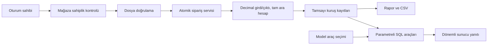

# Mimari ve dosya sözleşmesi

Motor Django'yu bilmez. Girdi ve para çıktıları Decimal'dır; kur/oran/iade/desi ara işlemleri Fraction ve tamsayı kuruş kullanır. ROUND_HALF_UP kararı ara Decimal precision'dan etkilenmez. Sipariş servisi hesapları ve tutar sınırlarını yönetir; importer, billing ve reports bu sınırda ortak istisna kullanır. Kur/komisyon aktarım anında sabitlenir. Yeni satır veya iade bütün siparişi aynı transaction içinde yeniden hesaplar. Rapor filtreleri ücretleri yeniden dağıtmaz. Tamsayı kuruşlar SQL toplamının float'a dönüşmesini önler; mutlak toplam sınırı zıt işaretlerden bağımsız kontrol edilir.

## Dosyalar

UTF-8 veya UTF-8 BOM CSV; virgül/noktalı virgül ayraç. cp1254 için UTF-8 olarak kaydetme açıklaması gösterilir. XLSX tek sayfa ve başlık satırı ister. Boş satırlar atlanır; formül ve yinelenen/bilinmeyen sütun reddedilir. CSV'de başlıkla farklı hücre sayısı reddedilir; XLSX'te eksik isteğe bağlı hücreler boş kabul edilir.

Zorunlu: `siparis_no`, `satir_no`, `tarih`, `urun_adi`, `urun_kodu`, `adet`, `birim_fiyat_kdv_dahil`, `kdv_orani`, `birim_maliyet_kdv_haric`.
İsteğe bağlı: `komisyon_orani`, `satici_indirimi`, `pazaryeri_kuponu`, `iade_adet`, `para_birimi`, `desi`, `agirlik_kg`, `maliyet_kdv_orani`, `doviz_kuru`.

Tarih YYYY-AA-GG/GG.AA.YYYY veya Excel tarihidir. Para en fazla 10 tam ve 2 ondalık basamak; binlik ayraç ve bilimsel gösterim yasaktır. KDV yalnız 0/1/10/20; komisyon 1–100 arasıdır. Excel oran hücresinde yüzde biçimi yasaktır: 20 yazılır. İndirim ve kupon toplamı brüt tutarı aşamaz. Adet pozitif, iade 0…adet, tamsayı en fazla 2147483647. Döviz kuru pozitif, en fazla altı ondalık; sipariş satırlarında para birimi/kur ortak olmalıdır.

Dosya toplamı 5 MiB, açılmış XLSX 25 MiB, ZIP girdisi 200, veri satırı 5000 sınırındadır. Streaming HTTP sınırı importer çağrılmadan durdurur; ZIP/XML kontrolü ayrıca uygulanır. Ücretsiz hesabın tüm mağazalarında toplam 100 satır kabul edilir. Finans satırı mutlak 9.000.000.000.000.000 kuruş; mağaza mutlak toplamı 9.000.000.000.000.000.000 kuruş sınırındadır.

## Tekrar aktarım ve geri alma

Bütün girdiler doğrulanmadan yazma başlamaz. Aynı kimlik ve aynı kaynak değerleri atlanır; farklı kaynak değeri bütün partiyi geri alır. UI iadeleri `imported_returned_quantity` kaynak tabanından ayrı tutulur; dosyayı yeniden yüklemek UI iadesini sıfırlamaz. Dosya özeti ancak bütün satır kimlikleri mevcutsa erken atlama sağlar.

Yeni satır `import_batch` ile onu ilk oluşturan partiye bağlıdır. Sahiplik kontrollü POST geri alma o partinin yeni satırlarını, bunlara bağlı UI iadelerini ve finans kayıtlarını siler; kalan siparişleri atomik yeniden hesaplar. Partide yalnız atlanan mevcut satırlar silinmez. Migration öncesinde kaynak parti ve kaynak iade miktarı bilinmediği için eski FK ve iade tabanı NULL kalır. Eski kayıtta yalnız iade alanı karşılaştırması atlanır; mevcut UI iadesi korunur, diğer alan çelişkileri reddedilir. Bilinmeyen geçmiş tahmin edilmez.

Eksik finans kaydı raporda açık uyarı ve eksik adetle görünür; CSV açık 409 hata döndürür. CSV UTF-8 BOM/noktalı virgül/virgüllü sabit iki ondalıkla Excel'e uygundur. Türkçe arama kalıcı normalize alanla İ→i, I→ı dönüşümünü kullanır; migration eski satırları doldurur. `rebuild_reports` kayıtları güncel pazaryeri sürümüyle yeniler.

## Güvenlik ve çalıştırma

WSGI/ASGI varsayılanı production'dır. Yerel `.env`, ayarlar okunmadan yüklenir. Üretim `DJANGO_SECRET_KEY` ve `DJANGO_ALLOWED_HOSTS` ister. CSRF origin listesi ve proxy HTTPS başlığı ortamdan ayarlanır; proxy başlığı yalnız güvenilir proxy dışarıdan gelen başlığı temizliyorsa etkinleştirilmelidir.

Giriş sınırı kullanıcı/IP ve IP için cache üzerinde uygulanır. Çok worker üretimde atomik add/incr destekleyen ortak Redis/Memcached kullanın; yerel bellek cache'i workerlar arasında sınırı paylaşmaz. Yerel server üretim dağıtımı değildir. Sahiplik servis ve HTTP sınırında denetlenir; state değiştiren istekler POST ve CSRF ister. Abonelik ödeme örneği tahsilat yapmaz.

Model yalnız read-only araç seçer; para ve sahiplik sunucudadır. Tarih parserı miktarları yıllardan ayırır, açık/göreli tek dönemi şemaya sabitler ve yanıt dönemini yazar. Çok dönem netleştirme; desteklenmeyen tutar eşiği açık kapsam cevabıdır. Model hatası unavailable döndürür. Sentetik eval transaction'ı geri alınır.
