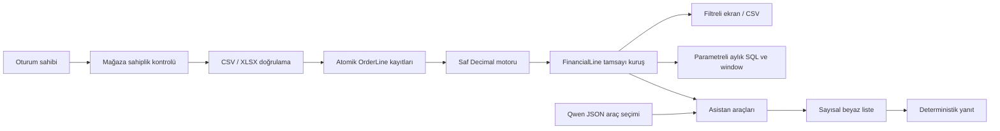

# Mimari ve doğrulama sınırları

Motor Django ve veri dosyalarını bilmez. Satır komisyonu ve kur içe aktarım
anında sabitlenir; sonraki mağaza varsayılanı eski siparişi değiştirmez.
Sipariş başına kargo/hizmet satırlara kuruş koruyarak dağıtılır. Yeni satır
veya iade bütün siparişi yeniden hesaplar. Finans kaydı ve kaynak satır aynı
transaction içinde güncellenir; başarısızlık hepsini geri alır.

Raporlarda SQLite Decimal aritmetiğinin kayan nokta riskini kaldırmak için
tamsayı kuruş kullanılır. Satır ve mağazanın toplam mutlak tutarı sınırlanır;
zıt işaretler birbirini götürse bile SQL SUM taşması engellenir. Rapor filtreleri
hesap ücretlerini yeniden dağıtmaz, kayıtlı satır sonuçlarını toplar.

Ücretsiz kota hesap sahibinin bütün mağazalarına uygulanır. Ödeme gerçek bir
servise gitmez; kullanıcı+UUID tekilleştirmesi sonucu korur. Aynı başarısız
istek UUID'sine sonradan success gönderilmesi planı değiştirmez.

Sahiplik hem HTTP dekoratöründe hem importer/asistan servis sınırında kontrol
edilir. CSRF, POST çıkışı, güvenli next yönlendirmesi Django'ya bırakılır.
Geliştirme/test/üretim ayarları ayrıdır. E2E async istisnası yalnız test fixture'ıdır.

Tek aritmetik oracle alan kuralını bağımsız doğrulamaz: Fraction referansı,
property testleri, mutasyon ve E2E farklı teknik riskleri kontrol eder;
insan denetimli sözleşme/altın set kabulünün yerine geçmez.

Gerçek model yalnız read-only rapor/kural aracını seçer. JSON şeması tarihleri
kullanıcının yazdığı ay/yıla sabitler; model oturum kimliği/SQL/para hesabı
üretmez. Bozuk yanıt veya model kesintisi unavailable olarak görünür.
Offline ve gerçek model ölçümleri ayrı saklanır. Eval fixture her durumda
rollback edilir. Hakem puanları insan kalibrasyonu olmadan güven ölçütü sayılmaz.
