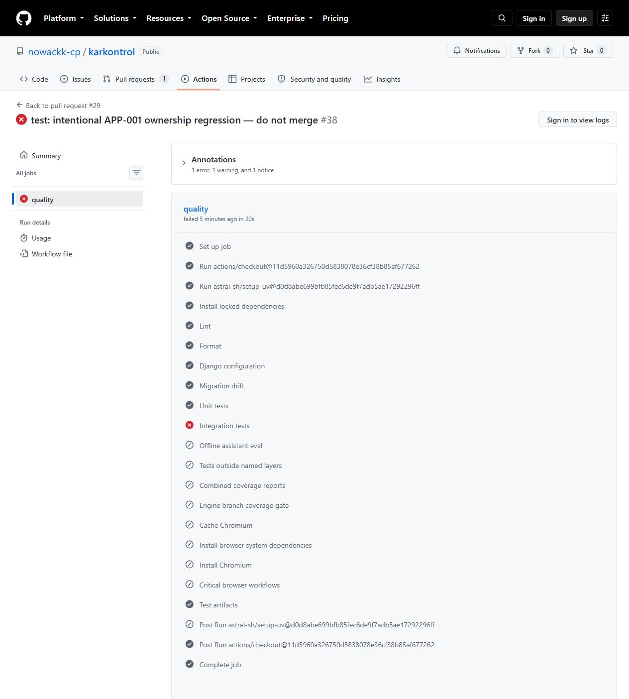

# Ölçümler ve kalite kapısı kanıtları

Bu belge README'nin önceki sürümündeki ayrıntılı ölçüm tablosunu ve kalite kapısı kanıtını değiştirmeden taşır. README yalnız özet gösterir; sayıların kaynağı burasıdır.

## Ölçümler

Bu tablo güncel sayısal ölçümlerin tek özetidir. Tarihî kanıtlar değiştirilmez.

| Ölçüm | Sonuç / kaynak |
|---|---|
| Çekirdek testler | Son yerel ve main Linux kaynağında 666 geçti: 259 unit, 153 integration, 254 eval; hakem için 33 ve kural konusu için 91 yeni regresyon |
| Chromium E2E | 13 geçti; gerçek tarayıcı, yeni üç para kartı ve farklı satırlar |
| Dev-only, Playwright yok | Son kaynakta 666 geçti / 1 opsiyonel paket atlandı |
| Mobil Chromium | 390×844 dokunmatik görünümde 13 geçti |
| Güncel motor dal kapsamı | Yerel ve main Linux CI'da 50/50 = %100; dışlanan satır yok |
| Tarihî dışlamalı mutasyon | 342/369 = %92,68; 27 kalan mutant: 14 mesaj, 9 davranış farkı, 3 strict eşdeğeri, 1 precision adayı |
| İlk dışlamasız mutasyon | 423/436 = %97,02; 13 kalan / 0 diğer. [Koşu](https://github.com/nowackk-cp/karkontrol/actions/runs/37249153652), c1481f4 kaynak sürümü; incelemesi ENG-002'yi buldu |
| Son dışlamasız mutasyon | 507/513 = %98,83; 6 kalan / 0 diğer. [Koşu](https://github.com/nowackk-cp/karkontrol/actions/runs/37250701744), [altı mutantın bağımsız incelemesi](../data/evidence/external-review/mutation-final/final-six-survivors.md): desteklenen API'de 6 eşdeğer, 0 test açığı. Eşdeğerler paydadan çıkarılmadı |
| İlk v2 geliştirme ölçümü | 34/40, 5 kritik hata → aynı sette prompt ayarı sonrası 40/40; genelleme kanıtı değildir |
| Modele atfedilebilir yönlendirici doğruluğu | İlk 30/36 → düzeltilmiş 36/36; 4 model öncesi güvenlik reddi ayrı. İnceleme notundaki 34/36 ham JSON ile uyuşmuyor |
| Anahtar kelime tabanı | Tarihî 40/40; yeni dönem geliştirme setinde yerel 52/52 |
| İlk v3 Qwen geliştirme ölçümü | 49/52; modele atfedilebilir 41/44, 2 kritik hata. [İlk ham yanıt](../data/evidence/external-review/llm-v3-first/eval.json) |
| İkinci / üçüncü v3 Qwen ölçümü | İkisi de 51/52, modele atfedilebilir 43/44, kritik hata 0. [İkinci](../data/evidence/external-review/llm-v3-second/eval.json) E-35; [üçüncü](../data/evidence/external-review/llm-v3-third/eval.json) E-24 hatasını korur |
| Önceki v3 Qwen ana dal ölçümü | 52/52; modele atfedilebilir 44/44, kritik hata 0. [Ana dal ham yanıtı](../data/evidence/external-review/llm-v3-final/eval.json), [koşu](https://github.com/nowackk-cp/karkontrol/actions/runs/37251483476). Ortak 40 eski vakada gerileme yok; 12 yeni vaka. Aynı geliştirme seti üzerinde ayarlandı |
| Kur düzeltmesinden önceki v3 tekrar ölçümü | 51/52; modele atfedilebilir 43/44, kritik hata 0. [Ham tekrar](../data/evidence/external-review/llm-v3-repeat/eval.json), [koşu](https://github.com/nowackk-cp/karkontrol/actions/runs/37254150079). Kaynak/prompt/veri hashleri önceki ölçümle aynı; E-26 kur sorusu KDV kuralına gitti. Önceki başarı bu sonuç yerine kullanılmadı |
| Son v3 Qwen ana dal ölçümü | 52/52; modele atfedilebilir 44/44, kritik hata 0. [Ham ana dal sonucu](../data/evidence/external-review/llm-v3-release/eval.json), [koşu](https://github.com/nowackk-cp/karkontrol/actions/runs/37270587083); açık kur konusu şemada doğrulanır. [Düzeltme PR ölçümü](../data/evidence/external-review/llm-v3-rule-fix/eval.json) ayrı korunur. Aynı sentetik geliştirme seti; insan kör kabulü bekliyor |
| Ayrı hakem yanıtlarının kullanılabilirliği | 30/30 şemaya uygun yanıt; [ham sonuç](../data/evidence/external-review/judge-final/judge-scores.json), [koşu](https://github.com/nowackk-cp/karkontrol/actions/runs/37253777571). Qwen3-0.6B ayrı ağırlık, aynı aile; insan etiketleri boş. Bu hakem doğruluğu veya insan uyumu değildir |

[Güncel main CI koşuları](https://github.com/nowackk-cp/karkontrol/actions/workflows/ci.yml?query=branch%3Amain) · [HTML raporları](https://nowackk-cp.github.io/karkontrol/) · [İlk başarısız LLM koşusu](https://github.com/nowackk-cp/karkontrol/actions/runs/37173824046) · [Kalıcı sürüm kanıtları](https://github.com/nowackk-cp/karkontrol/releases/tag/v1.2.0).

## Bulgular ve kalite kapısı

Sentetik baremde fiyatı 300,00 TL'den 300,01 TL'ye artırmak kârı **29,99 TL düşürebilir**: kargo bandı 30 TL artar. Bu test fiyat artışıyla kârın her zaman yükseldiği varsayımını engeller.

Main'de quality ve model-eval kontrolleri zorunlu; yönetici de kurala tabidir. [PR #29](https://github.com/nowackk-cp/karkontrol/pull/29) APP-001 sahiplik kontrolünün sırasını kasıtlı değiştirdi: [quality başarısız oldu](https://github.com/nowackk-cp/karkontrol/actions/runs/37251575603), [GitHub API açık PR'ı BLOCKED bildirdi](../data/evidence/external-review/app001-demo/open-state.json) ve [birleştirilmeden kapatıldı](../data/evidence/external-review/app001-demo/closed-state.json). Yalnız orders değiştiği için [model indirmesi atlandı, zorunlu model-eval başarılı sonuç bildirdi](https://github.com/nowackk-cp/karkontrol/actions/runs/37251575576). [Eski PR #4](https://github.com/nowackk-cp/karkontrol/pull/4) ve [gerçek eski kontrol ekranı](assets/pr4-checks.jpg) korunur. İnsan PR onayı yok.

Ekran görüntüsü GitHub'ın başarısız quality kontrolünü gösterir. Oturumsuz sayfada “Merging is blocked” kutusu görünmez; engellenme kaydı yukarıdaki ham API JSON'udur.
